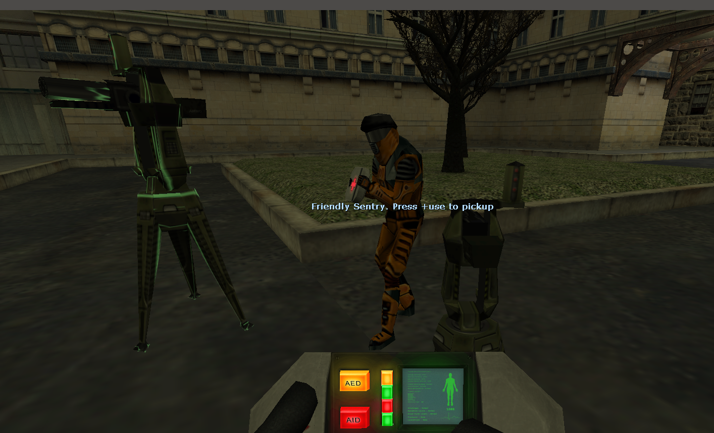

## Sentry Turrent Toy
This plugin will allow players to pickup, move, and spawn sentry turrents.
### Screenshot:



### ConVars:
- `sentry_toggle_mode` `1` - Allow turrents to be moved without having to hold the use key
- `sentry_max_per_player` `3` - Maximum spawned turrents per player
- `sentry_allow_spawning` `1` - Allow spawning of new turrents
- `sentry_pickup_others_allowed` `0` - Allow players to move/pickup turrents they did not spawn

ConVars can be set via `as_command ss.<cvar> <value>`

### Install:
Add the following to your `default_plugins.txt` file.

```
"plugin"
{
		"name" "Sentry"
		"script" "Sentry/Sentry"
		"concommandns" "ss"
}
```

### Notes:
Admins can spawn an unlimited amount of turrents.<br>
Non-admins can spawn turrents up to the maximum allowed. (Set `sentry_max_per_player` to `0`, to disallow non-admin spawning.)
